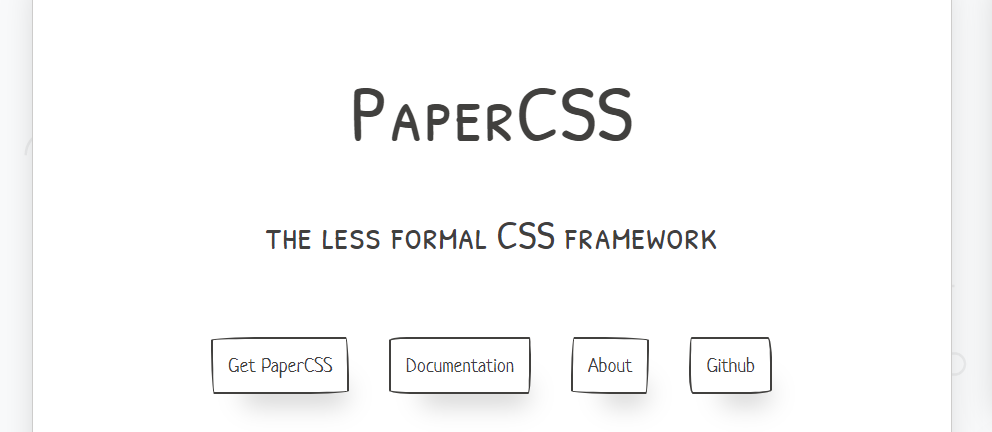
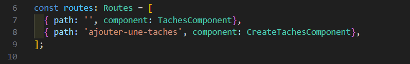
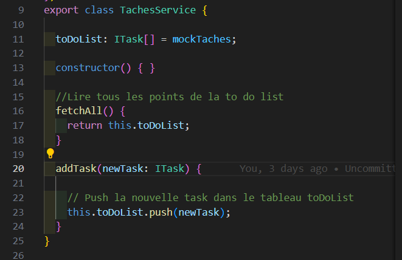
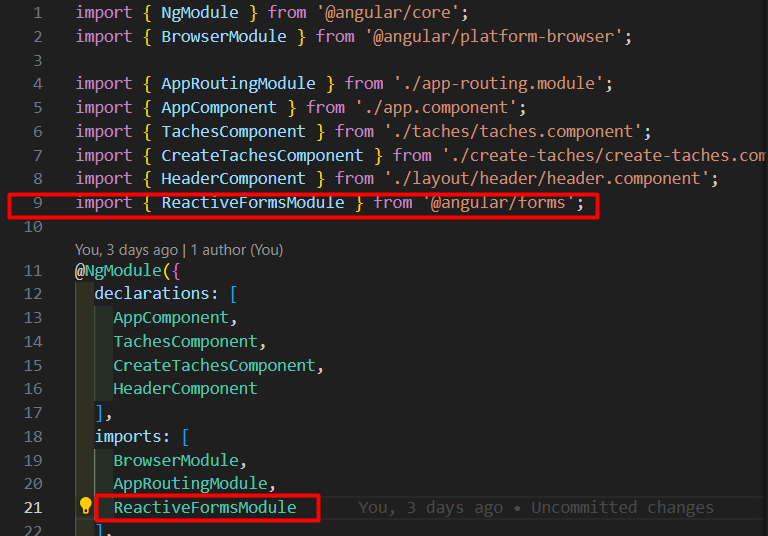
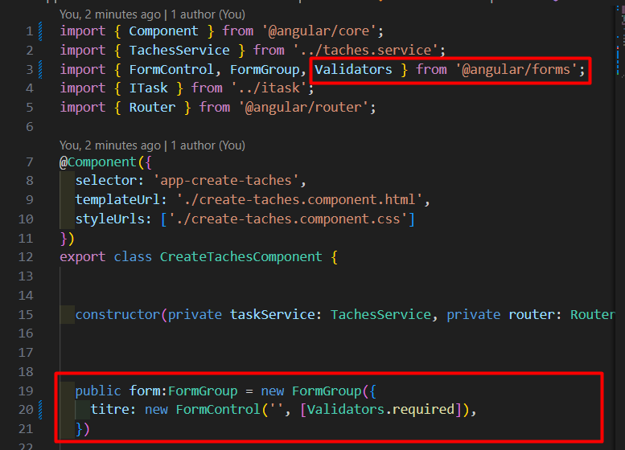
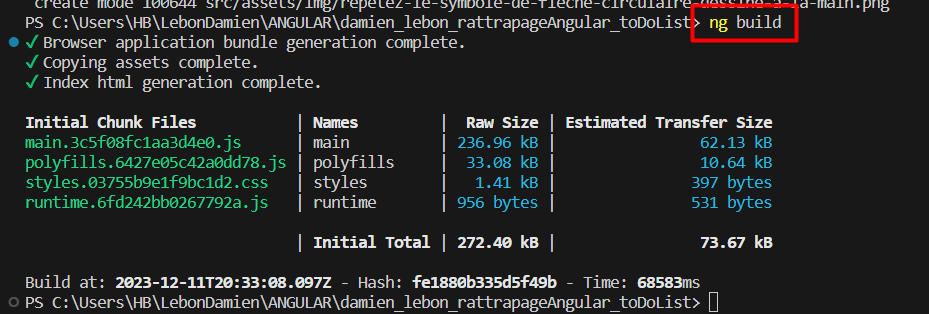
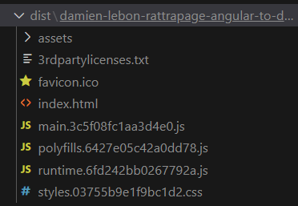

# Rattrapage Angular projet ToDoList

## Objectifs et fonctionnalités

- Développer une application "TodoList" avec Angular qui permet à l'utilisateur de visualiser une liste de tâches et de les ajouter.

- La fonctionnalité de marquer les tâches comme terminées sera gérée côté application sans indication initiale dans le mock.


## Framework CSS : PaperCSS

https://www.getpapercss.com/


---

## Les différentes étapes de developpement:

1. Création des composants Avec la commande suivante :  `ng generate component <nom-du-composant>`
    - TachesComponent
    - CreateTacheComponent
    - HeaderComponent
2. Configuration du routage dans app-routing.module.ts

3. Création du mock de données et l’interface.
```
{
  export const mockTaches = [
{
"id": 1,
"titre": "Acheter du lait",
},
{
"id": 2,
"titre": "Répondre aux e-mails",
},
{
"id": 3,
"titre": "Appeler le plombier",
}
];

}
```
4. Création du service 'tachesService' de gestion des tâches (Lectures des tâches et la création de tâches)
     - fetchAll() 
     - addTask()


5. Implémentation du formulaire d'ajout de tâches:
    - Utilisation de ReactiveFormModule pour le formulaire d'ajout de tâches dans le composant CreateTacheComponent.

    - Utilisation de Validators pour effectuer le contrôle du contenu de l'input lors de la soumission du formulaire.


6. Déploiement du projet sur Netlify:
    - Utilisation de la commande `ng build` pour générer un ensemble de fichiers statiques qui pourront être servis à partir d'un server standard, comme Apache ou Nginx. Et c'est l'ensemble de ces fichiers qui devront être déployés sur Netlify.
